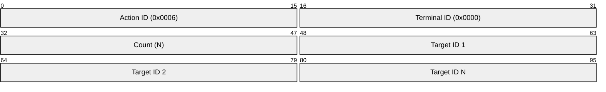

# Refactor Proposal: Consolidated Batch PTY Removal (`removePTYs` Command)

This proposal details the refactoring of the WebSocket command layer to replace both the single-terminal removal command (`ActionRemove` / `0x0006`) and the global workspace reset command (`ActionReset` / `0x000a`) with a single, batch-capable **`removePTYs`** command under action code **`0x0006`**.

---

## 1. Context & Rationale

Currently, pseudo-terminal removal and cleanup are split across two distinct commands:
1. **Single-Terminal Removal (`ActionRemove` / `0x0006`)**: Targets a single terminal ID specified in the header. The server reaps that terminal's processes and discards its registry.
2. **Workspace Reset (`ActionReset` / `0x000a`)**: Wipes the entire workspace registry, cancels all active spawning, clears all queues, and broadcasts a reset frame.

### Key Limitations of the Current Design
* **Inefficient Group Closures**: If a client closes a pane split-tree or tab group containing multiple active terminals (e.g., 5-10 panes), it must dispatch a sequence of individual `ActionRemove` frames over the socket. This increases network serialization overhead and mutex lock contention on the server.
* **Redundant API Surface**: Maintaining a distinct reset command (`0x000a`) adds extra serialization helpers and parsing paths on both the client and server.
* **Special-Case Semantics**: The server implements two different code branches for cleaning up resources, making the egress queue clearing and generation tracking logic more complex.

---

## 2. Refactor Goals

* **Retire the `ActionReset` (`0x000a`) command** completely from both the server and client codebase.
* **Redefine the `ActionRemove` (`0x0006`) command** to accept an array of terminal IDs in its payload, supporting batch closures.
* **Enforce Uniform Semantics**: The server will handle all removals (whether 1 PTY, a subset, or all active PTYs) using the exact same code execution paths, eliminating special-case wildcards or separate resetting states.

---

## 3. Wire Protocol Layout Change

The updated `ActionRemove` (`0x0006`) frame will carry the list of targets inside its payload:

### Header
* **Action ID** (`uint16` / 2 bytes): Set to `0x0006`.
* **Terminal ID** (`uint16` / 2 bytes): Set to `0` (ignored by the server, as target IDs are provided in the payload).

### Payload
* **`Count`** (`uint16` / 2 bytes): The number of terminal IDs being removed.
* **`Terminal IDs`** (Array of `uint16`): A contiguous sequence of two-byte big-endian terminal identifiers.

---

## 4. Server-Side Implementation Plan

The refactor involves modifying the `source` package of the `suprasole-server`:

### A. Parser Upgrades in [network.go](file:///home/coder/project/suprasole-server/source/network.go)
* **Retire Reset Handler**: Remove the switch case handling `ActionReset` (`0x000a`) from the socket read loop, rejecting any frames carrying this action ID.
* **Payload Validation**: Update the `ActionRemove` parser to read a two-byte unsigned integer count from the head of the payload. The parser must validate that the incoming frame length exactly matches the expected size (two bytes for the count, plus two bytes multiplied by the parsed count). If the payload boundaries do not match this calculation, the server immediately triggers a protocol validation error and closes the connection.
* **Target List Extraction**: Sequentially decode the two-byte big-endian terminal identifiers from the payload, assembling them into a slice of target IDs, and dispatch them to the workspace's core removal method.

### B. Core Refactor in [core.go](file:///home/coder/project/suprasole-server/source/core.go)
* **Unified API Entrypoint**: Retire the `ResetWorkspace` method and rename the `RemovePTY` method to a batch-capable variant (`RemovePTYs`) that accepts the slice of target terminal identifiers.
* **Spawning Context Aborts**: Iterate through the spawning terminals map. If any entry's ID matches a targeted ID in the removal slice, the server flags the instance as removed, triggers its context cancellation function to abort any active child process launches, and deletes the entry from spawning and pending priority maps.
* **Active Terminal Evictions**: Iterate through the active pseudo-terminal collection. For any terminal matching a target ID in the removal slice, the server locks its mutex, transitions its state flag to terminated, deletes it from the active map, and queues its file descriptor and process ID handles for asynchronous cleanup.
* **Synchronous Queue Purging**: Under the workspace mutex lock, the server scans the centralized egress queues. Any pending frames carrying a `TerminalID` matching any target ID in the list are discarded. The server adjusts the corresponding pending frame counters to prevent memory leaks and avoid writing stale stdout bytes to the socket.
* **Asynchronous Process Group Reaping**: Outside the critical workspace lock cycle, the server performs process group reaping for all targeted active terminals. It retrieves the process ID of the running shell, recursively kills all descendant processes in the group, and terminates the main process to prevent orphan process leaks. Finally, it closes the corresponding pseudo-terminal master file descriptor.
